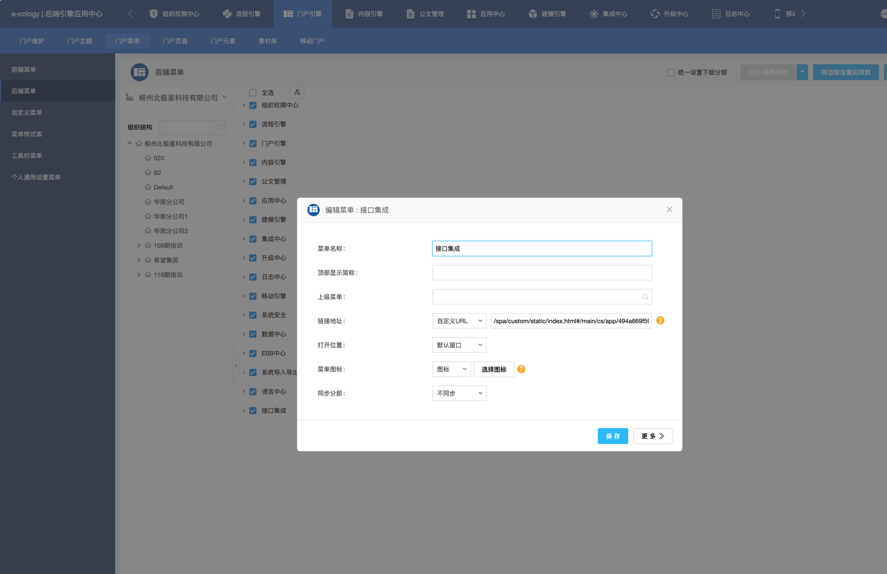
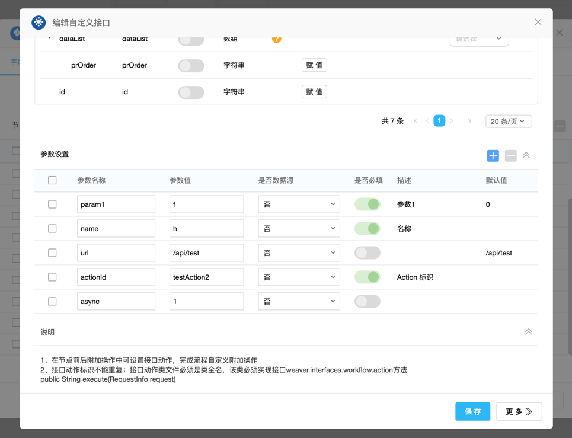
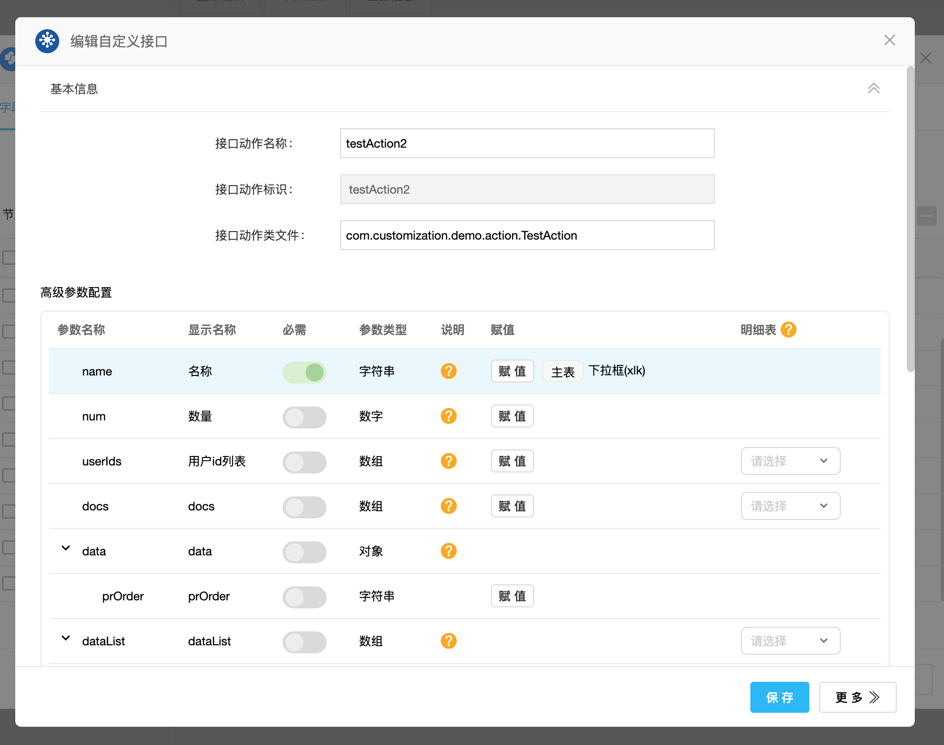
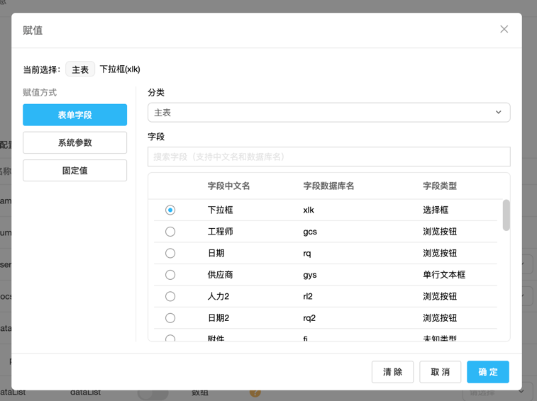
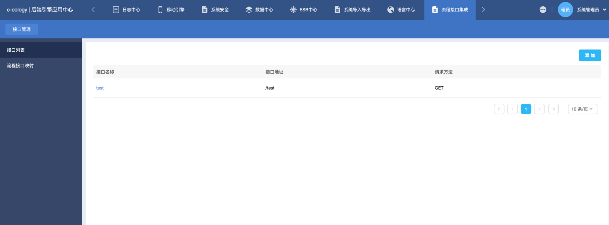
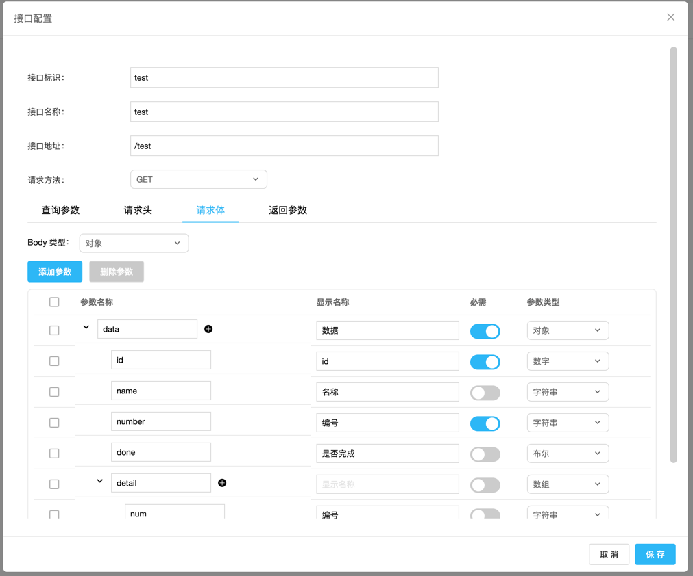
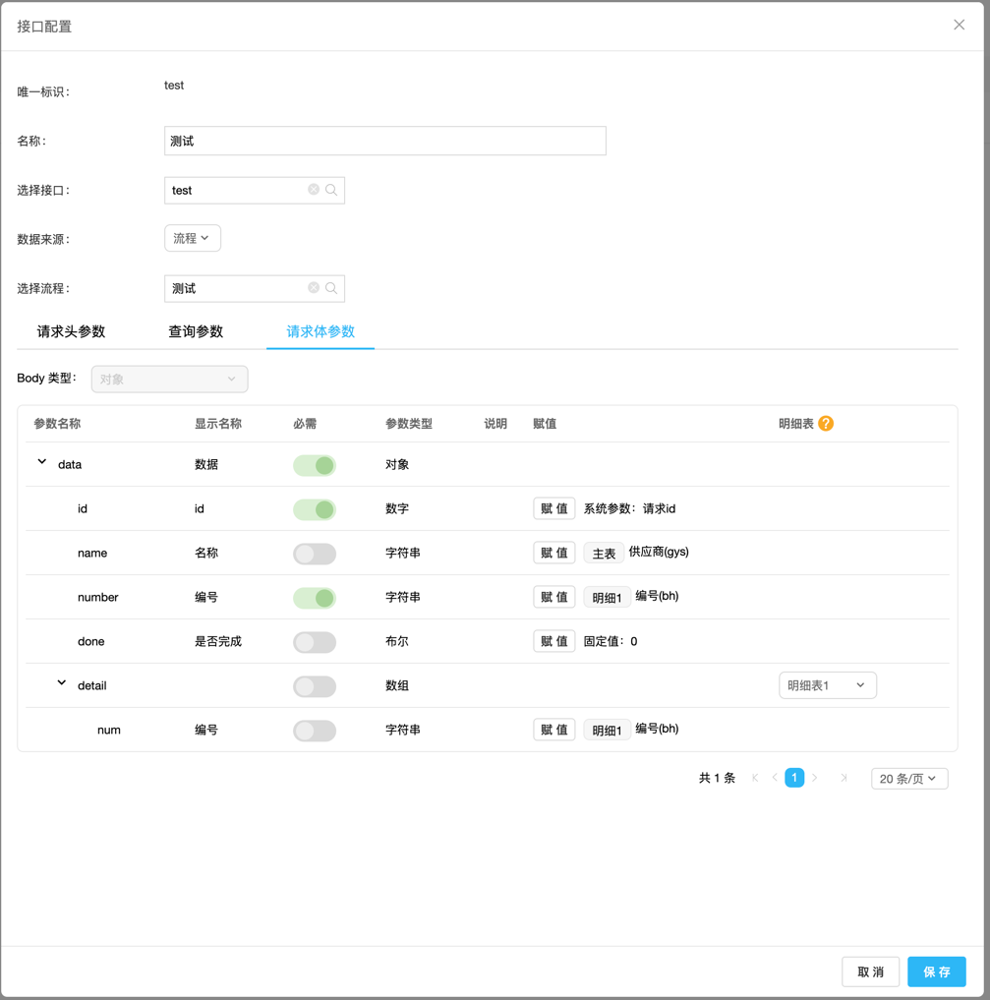

# <h1 align="center">泛微 E9 二次开发扩展 <br> Second-dev `Extend`</h1>
这是一个针对泛微 E9 二次开发的增强套件，针对二次开发提供了一些增强和便捷功能。  

注意：这些功能尚属于试验性功能，还未得到充分验证，我还在持续完善，敬请期待

## 如何使用 👈

### 后端部署

有两种方式：

1. 将本项目中的 `weaver-seconddev-extend-1.0.0.jar` 部署到服务器中的 `ecology/WEB-INF/lib` 目录下，重启服务器后即可使用
2. 下载本项目源码，将本项目打成 jar 包后部署到服务器中的 `ecology/WEB-INF/lib` 目录下，重启服务器后即可使用

此外还需要引入一个公共类库的依赖，需下载此依赖的 jar 包，并部署到服务器中的 `ecology/WEB-INF/lib` 目录下，依赖地址：
请查看本人的另一个项目 `weaver-e9-common`, https://gitee.com/yaolilin/weaver-e9-common

### 前端部署

将本项目下的 ecode 文件夹中的 ecode 应用（格式为zip）导入到系统中的 ecode 中，并发布。

#### 后端菜单配置

需要在后端门户引擎中添加后端菜单，菜单地址：
`/spa/custom/static/index.html#/main/cs/app/494a669f59304c6dae317a190d8159a3_Index`  
菜单名称为：接口集成  
之后就能通过该菜单进入配置页面，配置接口与参数映射



### 建模导入

导入建模目录下的建模应用到系统中

## 功能说明
### 流程 Action 参数增强
- 可自动获取流程 Action 接口的参数，无需手动添加
- 新增是否必填、描述、默认值信息，便于查看参数信息，在后端中需要配合 `@ActionParam` 注解使用



#### 如何使用
在代码中需要使用 `@ActionParam` 注解来标注参数，不使用该注解在前端中也能自动获取到该参数，
只是会缺乏注解中的一些信息，示例如下：

```java
public class TestAction3 extends AbstractWorkflowAction {

    /**
     * 传入参数，使用 @ActionParam 进行必填校验
     */
    @ActionParam(required = true,displayName = "参数1",desc = "测试参数")
    private String param1;

    @NotNull
    @Override
    protected ActionResult doExecute(RequestInfo requestInfo) {
        
        return new ActionResult(true, "成功");
    }
}
```
### 流程 Action 高级参数配置
一个类似于 E10 动作流的参数配置，支持 JSON 结构化参数和自定义赋值，后端中可与流程字段解藕，即字段值获取由前端配置，而不是
写死在后端中，特别适合在后端中调用接口，接口参数取流程表单字段值的场景

- 以 JSON 格式定义参数，支持更复杂的参数结构
- 可在后端中将参数转为 java 对象
- 可对参数进行自定义赋值，参数可取表单字段值、流程系统变量以及固定值
- 可获取明细数据，并根据参数类型转化为数组
- 参数由后端定义，前端自动获取参数，前端只需配置参数赋值
- 支持参数必填校验

  

  

在 Action 类中使用参数:

```java
public class TestAction extends AbstractExtendWorkflowAction<TestActionParam> {

    @ActionParam(required = true, desc = "Action 标识")
    private String actionId;

    @Override
    protected ActionResult doExecute(RequestInfo requestInfo, TestActionParam param) {
        // 使用参数，参数中的属性的值会根据前端的配置自动注入
        String name1 = param.getName();
        return new ActionResult(true, "执行成功");
    }

    @Override
    protected String getActionId() {
        return actionId;
    }

    @Override
    public Class<TestActionParam> getParamType() {
        return TestActionParam.class;
    }
}

```

#### 如何使用
在后端中 Action 创建时需要继承 `AbstractExtendWorkflowAction` 类，并实现方法，该类的范型参数为 Action 传入的
参数类型。  

你需要实现 `getActionId()` 方法，来获取 Action 的标识，该标识为流程后端 Action 配置中的接口动作标识，
你可以在当前 Action 中添加参数来获取 Action 标识，就能在流程 Action 配置中将 Action 标识填写到该参数，比如：
```java
 @ActionParam(required = true, desc = "Action 标识")
 private String actionId;
```
你需要实现 `getParamType()` 方法，来获取 Action 参数的类型，该类型与 `AbstractExtendWorkflowAction` 的范型参数一致，
以便于后端将 JSON 参数转化为 Java 对象。  

Action 示例如下：

```java
public class TestAction extends AbstractExtendWorkflowAction<TestActionParam> {
    
    @ActionParam(required = true, desc = "Action 标识")
    private String actionId;
    
    @Override
    protected ActionResult doExecute(RequestInfo requestInfo, TestActionParam param) {
        if (param == null) {
            return new ActionResult(false, "参数为空");
        }
        return new ActionResult(true);
    }

    @Override
    protected String getActionId() {
        return actionId;
    }

    @Override
    public Class<TestActionParam> getParamType() {
        return TestActionParam.class;
    }
}

```
**参数对象说明：**  
参数对象可作为参数传入 Action 中，对象属性的值会根据前端配置的赋值生成，参数属性可使用 `@ActionParam` 注解标注，来描述参数信息
，支持嵌套对象，参数属性除了支持基本类型外，还支持支持 List 、 Map 参数类型，在前端中将会根据参数类的结构显示参数配置

```java
@Data
public class TestActionParam {
    @ActionParam(displayName = "名称",desc = "名称",required = true)
    private String name;
    @ActionParam(displayName = "数量",desc = "数量",defaultValue = "1")
    private Integer num = 1;
    @ActionParam(displayName = "用户id列表",desc = "用户id列表")
    private List<Integer> userIds;
    @ActionParam(desc = "文档列表")
    private List<String> docs;
    @ActionParam(desc = "数据")
    private InnerObj data;
    @ActionParam(desc = "数据列表")
    private List<InnerObj> dataList;
    private String id;

    @Data
    public static class InnerObj {
        private String prOrder;
    }
}
```

### 接口管理
接口管理可配置多个接口信息，包括请求路径和请求参数，还可配置请求参数的赋值，便于在后端中调用接口并生成请求参数，采用参数赋值解藕设计，表单字段
值在前端配置，后端无须关心是取哪个接口。  

**接口信息配置：**
- 可配置接口路径、请求方法、请求参数等信息

**接口参数映射：**
- 可配置接口参数的赋值，可取流程或建模字段的值
- 可通过后端调用生成接口参数
   
    

  



#### 后端生成接口参数
在前端配置好接口参数映射之后，可在后端传入流程请求id或建模数据id，生成接口请求参数。

后端调用示例：
```java
void generateParamsByConfId_actualTest() {
    TestUtil.setLocalServer();
    ApiParamGenerator paramGenerator = ApiParamGeneratorImpl.instance();
    // 传入接口参数映射配置标识与请求id，生成接口参数，接口参数值将会根据前端配置的参数赋值规则生成
    Optional<ApiParamObject> paramOp = paramGenerator.generateParamsByConfId("test", 684684);
    ApiParamObject apiParamObject = paramOp.get();
    System.out.println("header:"+apiParamObject.getHeader());
    System.out.println("body:"+new JSONObject(apiParamObject.getBody()));
}
```
输出：
```
header:{test=2026-01-08, name=项目1, id=1}
body:{"data":{"number":"1,2,3,4","name":"供应商xx","id":684684,"detail":[{"num":"1"},{"num":"2"},{"num":"3"},{"num":"4"}],"done":false}}
```

## 实现原理

### 流程 Action 参数自动获取

通过传入 Action 的类路径，获取到 class 对象，通过反射来获取到类里面的成员，识别为 Action 参数，并获取成员上的
@ActionParam 注解信息来获取参数的描述、是否必填等信息，最后将参数信息返回给前端

### 流程 Action 高级参数配置

#### 参数获取

1. 通过反射，获取 Action 类中的 `getParamType()` 方法，来获取参数的类型
2. 通过反射，获取到参数类型中的成员，以及嵌套的成员对象，获取成员中的 @ActionParam 注解信息来获取参数的描述、是否必填等信息，
   然后生成 `List<WorkflowActionAdvanceParamDTO>` 对象，该对象中存储了所有的参数数据
3. 获取数据库表中的参数赋值信息，将参数赋值信息合并到 `List<WorkflowActionAdvanceParamDTO>` 对象中
4. 将参数信息返回给前端，前端根据参数信息来展示参数配置，生成 JSON 形式的参数配置

#### 参数值注入

在前端配置了 Action 参数的值，在执行 Action 时，可根据配置的参数赋值，对 Action 参数对象中的属性进行赋值

原理：

1. 在 `AbstractExtendWorkflowAction` 中，通过 `getParamType()` 方法获取参数类型，通过 `ApiParamValueInjector`
   对参数对象进行属性值注入
2. 在 `ApiParamValueInjector` 中，对参数对象中的属性进行递归处理，根据前端配置的参数赋值规则，来获取到参数值，并通过
   反射将值赋值到属性中
3. 在对参数对象属性值注入的过程中，会根据属性的类型，以及前端配置的赋值，来对赋值进行处理，比如
   如果字段类型为 List<Integer> ,获取的值为字符串且包含逗号，如：1,2,3 ，将会对字符串进行拆分转为 List

#### 接口参数生成

在前端配置好接口参数以及赋值规则，在后端就能生成接口的参数，比如请求头参数，请求体（JSON）参数

原理：

1. 后端通过 `ApiParamGenerator` 接口来生成接口参数
2. 在 `ApiParamGeneratorImpl` 实现类中，获取保存到数据库中的接口参数配置，遍历和递归接口参数，根据配置的参数类型来
   生成接口参数类型，比如 List、Object、String
3. 根据赋值规则来获取参数值，比如从流程表单字段中获取值，或者固定值


